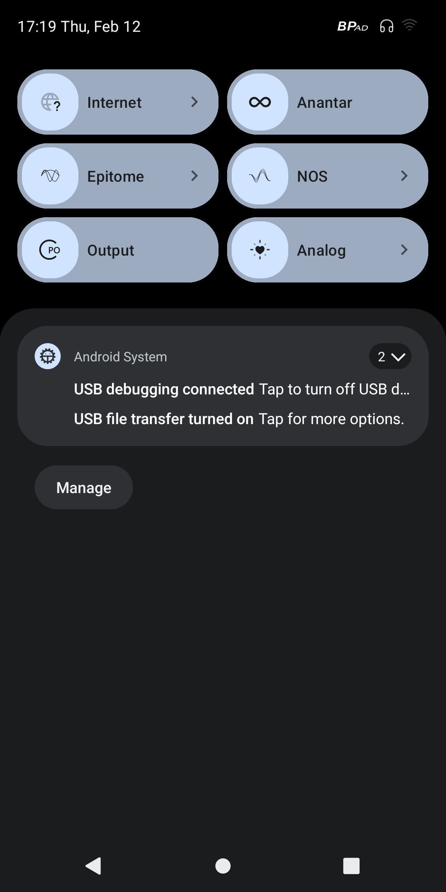
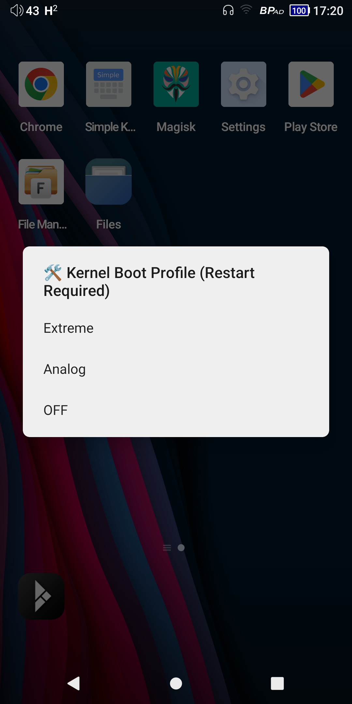
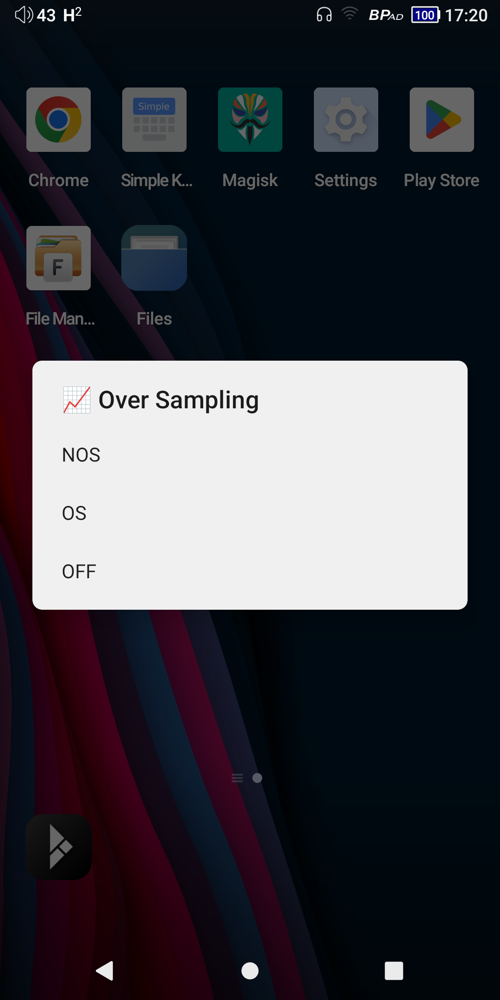
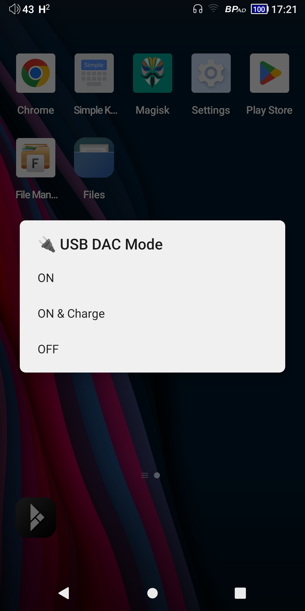
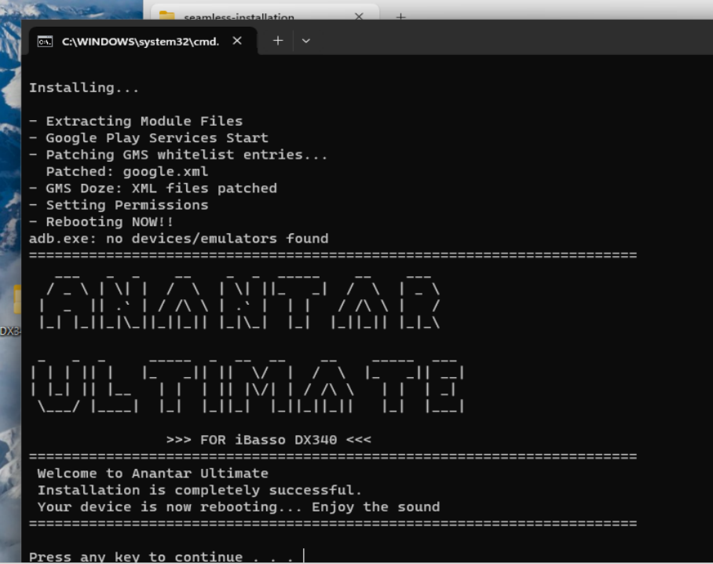
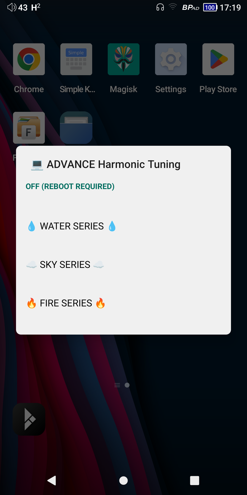
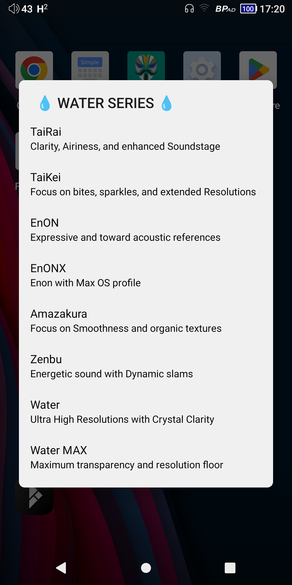
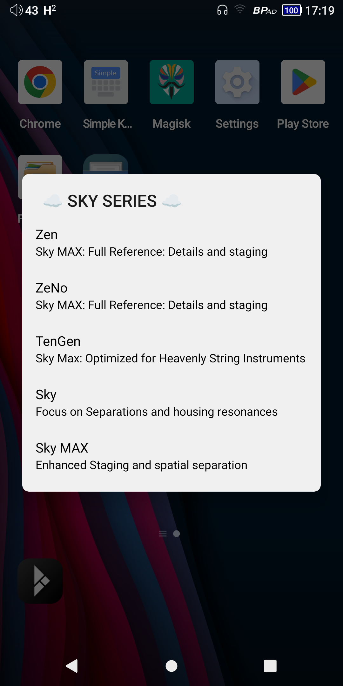
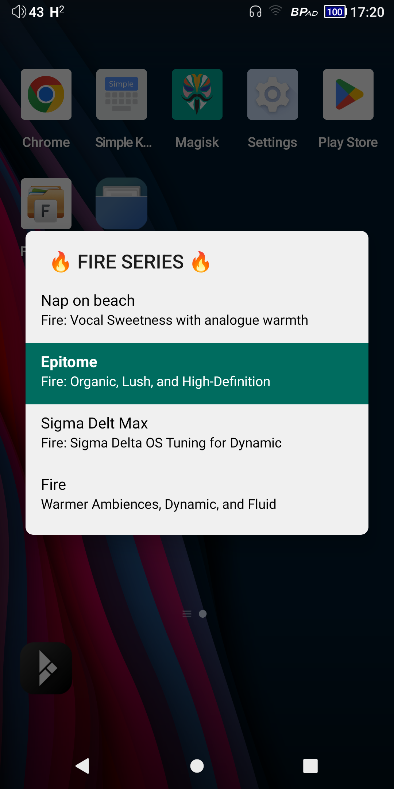

# Anantar Ultimate for iBasso DX340 
### 🔥 Proudly Researched and Developed with Passion by tekChansin (Thailand 🇹🇭) | Head-Fi

💸 **100% FREE TO USE** — *Anantar Ultimate is a passionate community-driven project provided completely free of charge. No hidden fees, no premium tiers.*


**Anantar Ultimate** is a complete, fresh re-rework built upon the foundations of the original Anantar projects. This version consolidates and improves upon the legacy modules (**Anantar Sound, Anantar Kernel, and MoonDiamond**) into a single, high-performance "Ultimate" edition for a streamlined and superior experience.

> [!IMPORTANT]
> **Compatibility & Requirements:**
> * **Firmware Requirement:** This module supports **iBasso Firmware 1.08 or higher** only.
> * **Module Conflict:** Before installing Anantar Ultimate, please **Disable or Remove** legacy modules: *Anantar Sound Profile, Anantar Kernel Boot, and MoonDiamond.*
> * Automatic uninstall other mods via **ADB remount** (Stouthart or SealPoint) without data loss
> * ⁠⁠Factory reset is not necessary before running the installation

---

🔥 **NOW WITH 1-CLICK SEAMLESS INSTALLATION!** 🔥
> **Experience the ultimate sound without the hassle.** We have developed a dedicated automated installer program. Installing Anantar Ultimate has never been easier—just download, click once, and let our script automatically handle everything from Debloating, Rooting, to Module Installation in under 10 minutes!

---

# Table of Contents

- [🚀 Key Features](#-key-features)
- [📝 Release Note](#-release-notes)
- [📱 Screenshots](#-screenshots)
- [⚡ Seamless Installation Anantar Ultimate (10Mins - Supereasy)](#seamless-installation-anantar-ultimate-10mins---recommended)
- [📂 MangoOS Integration](#-mangoos-integration)
- [🎼 Audio & Kernel Profiles](#-audio--kernel-profiles)
- [💎 Harmonic Profiles Engine](#-harmonic-profiles-engine)
- [🔋 DeepSleep Mode](#-deepsleep-mode)
- [💡 Why EXT4? (Technical Deep Dive)](#-why-ext4)
- [🛠 Step-by-Step: Formatting via ADB](#-step-by-step-formatting-via-adb)
    - [How to Format back to exFat](#format-back-to-exfat)
- [⚠️ Limitations of EXT4](#-limitations-of-ext4)
- [⚠️ Modding Risks & Safety](#%EF%B8%8F-modding-risks--safety)
- [⚠️ Known Issues](#-known-issues)
- [📩 Contact & Feedback](#-contact--feedback)
 - [Manual Installation (For Power Users)](#manual-installation-for-power-users)
- [🛠️ Maintenance & Recovery Guide](#ibasso-dx340-maintenance--recovery-guide)
---

## 🚀 Key Features

#### 🎼 **Enhanced Sound Signature**
* Advanced tuning that delivers a **3D Large SoundStage**, **Clarity**, superior **Instrument Separation**, excellent **Dynamic** range, and a more natural, **Warm Vocal** delivery.


#### 🤖 **Auto Profile Selection**
* Not sure which profile to choose? The system automatically selects the optimal default profile that perfectly matches your currently installed AMP module. Enjoy a simple, flexible, and hassle-free listening experience right out of the box.

#### 🔋 **Flawless 32-Bit/192kHz Playback** 
* Completely resolved the stalling and lagging issues present during high-resolution playback. You can now flawlessly play heavy, high-res audio files without any stuttering, dropouts, or performance bottlenecks.

#### 🎶 **FW 1.08 Sound Signature Correction**
* Fixed the overly bright and dynamically flat sound profile introduced in stock firmware 1.08. This optimization restores the lost dynamics and musicality, bringing back an engaging, full-bodied, and punchy listening experience.

#### 🎛️ **Harmonic Profiles Engine (Hardware-Level)**
A true hardware-level enhancement. Instead of relying on software DSP, this engine directly commands the DX340's internal FPGA to alter the harmonic sequence. Because the adjustment occurs entirely at the hardware level, it maintains absolute signal purity and fully supports all audio formats, including native DSD playback, with zero software-induced degradation.

#### ⚙️ **Kernel Boot Profiles**
* Deep system-level optimization that applies specialized kernel configurations right from the boot stage. This grants precise control over CPU governance, power management, and audio thread prioritization, ensuring the hardware runs at peak efficiency for the ultimate, jitter-free listening experience.

#### 🔄 **MangoOS Compatibility**
* Experience Anantar optimizations even in MangoOS. Configure your profiles in Android, and the settings will **persist even after booting into MangoOS**.

#### 💿 **Native EXT4 Support**
* Unlock maximum audio potential with **Native EXT4 File System** support. By eliminating the exFAT translation layer, it reduces CPU overhead and jitter, resulting in a **10-15% improvement** in soundstage depth and micro-detail resolution.

#### 🎨 **New UI & Quick Access**
* A completely refreshed interface with dedicated **Quick Settings Tiles** on the status bar for instant, on-the-fly control of your audio profiles.

#### 🖥️ **Intelligent Desktop Mode & Auto Battery Bypass**
* Transform your DX340 into a true desktop powerhouse. When connected to a >9V and not exceed 12V USB power source or a Linear Power Supply (such as LHY Audio), Anantar Ultimate intelligently commands the USB chip to **automatically disconnect the internal battery the moment you hit play**. This drastically eliminates battery-induced noise, delivering an ultra-clean, pure desktop-grade audio experience. Once playback stops, the system seamlessly reconnects the battery, providing a fully automated, true desktop mode without any manual switching. 
* Do not use USB C exceed than 12V.

#### 🌐 **Easy USB DAC on Tile**
* Enjoy high-fidelity USB DAC functionality across the entire Android system. No longer restricted to MangoPlayer—use **Tidal, Apple Music, or Spotify** with full optimization.

#### 🔋 **DeepSleep Mode** 
* An automated power-management feature designed to maximize battery longevity by strictly limiting hardware activity during periods of inactivity.

#### ⚡ **High-Speed File Transfer (UMS)**
* Full support for **USB Mass Storage (UMS)** on SD Cards. Transfer files at ultra-high speeds directly from MacOS and Android devices.

#### 🧹 **System Health Optimization**
* Keeps your storage clean by automatically removing empty Android junk folders on your SD Card, ensuring a lean and efficient filesystem.

#### 📲 **Seamless OTA Updates**
* Updating Anantar Ultimate is now easier than ever. Say goodbye to connecting your DX340 to a PC—receive the latest features, sound optimizations, and bug fixes directly over-the-air (OTA). Keep your device up to date instantly and effortlessly with just a few taps.

---

### 📱 Screenshots

| Quick Settings | Boot Profiles | OverSampling | USB DAC Support |
| :---: | :---: | :---: | :---: |
|  |  |  |  |


---

# 🚀 Installation Guide (Quick Start)

### Prerequisites
- A computer (PC or Mac) with **ADB (Android Debug Bridge)** installed.
- A high-quality USB-C cable.

### Step 0: Prepare the Device
1. **Enable Developer Options:** Go to `Settings` > `About phone` > Tap `Build number` 7 times.
2. **Enable USB Debugging:** Go to `Settings` > `System` > `Developer options` > Turn on `USB debugging`.
3. **Authorize Connection:** Connect the DX340 to your PC. On the device popup, select "Always allow" and tap "Allow."

## Seamless Installation Anantar Ultimate (10Mins - Recommended)

 

This is the fully automated, 1-click method. The script handles ADB checks, debloating, rooting, and module installation automatically.

> **Automatic uninstall other mods via ADB remount (Stouthart or SealPoint) without data loss**

> **This Installation script can re-run without problem**

## Download Link: [Anantar-Ultimate-Installer](https://tekfile.s3-bkk.nipa.cloud/anantar-ultimate/Anantar-Ultimate-Installer.zip)

1. **Download & Extract:** Download and extract the ZIP file to a folder on your computer.
2. **Connect Device:** Connect your DX340 to your computer via a USB cable. 
   *(Note: If prompted on your DX340 screen, check "Always allow from this computer" and tap **Allow**).*
3. **Connect Wifi:** Keep Wifi connected during the installation process.
4. **Run the Installer:** Open the extracted folder and double-click the script for your operating system:
   * **Windows:** Double-click `Windows-Anantar-Ultimate-Installer.bat`
   * **macOS / Linux:** Double-click `MacOS-Anantar-Ultimate-Installer.command`
     *(macOS Tip: If it fails to run, open Terminal, type `chmod +x `, drag the `.command` file into the Terminal, press Enter, then try double-clicking again).*
5. **Follow On-Screen Prompts:** The script will automatically open the Magisk app on your DX340 during the process. If Magisk prompts you for **"Additional Setup"**, simply tap **"OK"**. The script will wait patiently if the device reboots.
6. **Done!** Once you see the **ANANTAR ULTIMATE** logo in the terminal window, the installation is complete and your device will reboot automatically and wait for 15 seconds.


---

## 📂 MangoOS Integration
Anantar Ultimate is designed to influence the system at a low level, allowing its benefits to persist across both OS environments.

**How to use with MangoOS:**
1. Boot into **Android Mode**.
2. Select your desired **Kernel Boot Profile**, **OverSampling Mode**, and **Harmonic Profile**.
3. Once configured, simply **Switch/Boot to MangoOS**.
4. Your chosen optimizations will remain active, providing the Anantar Ultimate sound signature within the MangoOS environment.

---

# 🎼 Audio & Kernel Profiles 

 

### 🎧 OverSampling Modes
Select your preferred digital-to-analog processing style:
1. **Default iBasso:** The stock factory oversampling configuration.
2. **NOS Mode (Non-OverSampling):** Bypasses digital filtering for a raw, phase-coherent, and musical sound.
3. **Improved OverSampling Mode:** A custom-tuned oversampling algorithm designed for better transient response and reduced ringing artifacts.

### ⚙️ Kernel Boot Profiles
Control system processing and power delivery at the core:
1. **Extreme:** Maximize CPU performance and system responsiveness for the most precise audio processing.
2. **Analog:** Optimized power delivery and clocking to provide a smooth, organic, and "analog-like" sound signature with reduced digital glare.
3. **Default iBasso Boot:** Reverts the system behavior to the original factory specifications.

---

# 💎 Harmonic Profiles Engine
Over **18+ customized harmonic profiles** categorized into three signature series:

| Harmonic Menu | Water Series | Sky Series | Fire Series |
| :---: | :---: | :---: | :---: |
|  |  |  |  |


### 💧 Water Series
* **TaiRai / TaiKei** | **EnON / EnONX** | **Amazakura** | **Zenbu** | **Water / Water MAX**

### ☁️ Sky Series
* **Velvet** | **Maven** | **Zen** | **ZeNo** | **TenGen** | **Sky** | **Sky MAX**

### 🔥 Fire Series
* **Nap on Beach** | **Epitome** | **Sigma Delt Max** | **Fire**

---
### 🔋 DeepSleep Mode

The **DeepSleep Mode** is an automated power-management feature designed to maximize battery longevity by strictly limiting hardware activity during periods of inactivity.

#### **Trigger Logic**
The system will transition into DeepSleep mode if the following conditions persist for **15 minutes**:
* **No Audio Playback:** No active media or music streams are detected.
* **No USB Connectivity:** The device is not connected to a computer or a power source via USB.


#### **System Optimizations**
Once activated, the system enforces the following power-saving protocols:
* **CPU Frequency Scaling:** Forces the processor to its lowest possible frequency and power state.
* **Radio Shutdown:** Automatically disables **Wi-Fi** and **Bluetooth** to eliminate idle battery drain.
* **Background Suspension:** Terminates or freezes all background applications and non-essential system processes.

#### **Instant Resume**
To maintain a seamless user experience, the device monitors the display status. As soon as the **screen is turned on**, the system performs an **instant state resume**. This restores all previous network connections and application states immediately, allowing for extreme power efficiency without the delay of a full reboot.

---

## 💡 Why EXT4?

* **Native Compatibility:** EXT4 is the native file system for the Linux Kernel and Android; every system partition on your device already uses EXT4.
* **Lower Overhead:** Unlike exFAT, which requires an extra software layer (FUSE/Driver), EXT4 is handled directly by the kernel, reducing CPU load and electrical noise.
* **MangoOS Support:** **Anantar Ultimate** provides full native support for EXT4 on MangoOS.
* **SQ Improvement:** You can expect a **10-15%** improvement in sound quality, characterized by a significantly larger stage, better 3D positioning, and enhanced resolution.

## 🛠 Step-by-Step: Formatting via ADB

Execute these commands via **ADB Shell** (Root access required) to format your microSD card with optimized parameters for high-fidelity audio playback.

### 1. Backup your microSDcard 
* I recommend to backup songs from microSD to localstorage, it is easy when you transfer it back after you format it.
### 2. Insert microSD card into DX340
### 3. Connect DX340 to PC 
### 4. Grant Shell Permission
- Go to Magisk App
- Superuser tab
- Enable "Shell"

### 5. Format microSD via DX340
* adb shell
```
adb shell
```

* unmount microSD
```
su
sm list-volumes public
sm unmount public:179,1
```
* Format microSD
This step will be confirmation promt, you need to type "y". please copy this command without new line.
```
mke2fs -t ext4 -b 4096 -O ^has_journal,extent,sparse_super -m 0 -L Swissbit /dev/block/vold/public:179,1
```
* Mount microSD and fix permission
```
sm list-volumes
sm mount public:179,1

TARGET=$(mount | grep "/dev/block/vold/public:179,1" | awk '{print $3}') && chown -R 1023:1023 $TARGET && chmod -R 775 $TARGET
```

## ⚠️ Limitations of EXT4

While EXT4 offers superior audio performance, it is important to understand the compatibility constraints:
<details>
* **No Direct Mounting on PC/Mac:** Windows and macOS do not natively support EXT4. You cannot simply plug your microSD card into a card reader and expect it to show up as a drive.
* **MTP Transfer Required:** To add or manage music, you must connect your **DX340** to your computer via USB and use **MTP (Media Transfer Protocol)** mode.
* **Software for macOS:** For Mac users, the native "Android File Transfer" can be unstable. It is highly recommended to use **"MacDroid"** for faster and more reliable file management via ADB/MTP.
* **Android/Linux Only:** This card will only be readable by Android devices or computers running a Linux distribution.
</details>

### Format back to exFat
* Go to Setting -> Storage -> select SDcard -> top 3 dot -> format

---

## ⚠️ Known Issues
* **Module Deactivation after MangoOS Reboot:** When rebooting from **MangoOS back to Android**, the Magisk module may occasionally become disabled or "drop out."
    * **How to Check:** Pay attention to the **Boot Animation**. If you do not see the custom Anantar boot animation, the module has likely been disabled.
    * **Solution:** Simply go into the Magisk app and **Re-enable** the Anantar Ultimate module, then reboot once more.

---

### ⚠️ Modding Risks & Safety

While system modification always carries a degree of responsibility, this project is designed with multiple safety nets to ensure your device remains protected.

#### **Software Integrity**
There is **virtually no risk of a permanent software brick**. iBasso provides official **Qualcomm factory images (.img)** that can be flashed via **QFIL (Qualcomm Flash Image Loader)**. 
* **Recovery:** In the event of a boot loop or system instability, you can simply reflash the stock firmware to restore the device to its factory state.
* **Serviceability:** Once restored to the original firmware, the device can be sent to iBasso’s official service centers for hardware support if needed.

#### **Official Stance**
It is important to note that **iBasso is fully aware of these community modifications**. They have shown a supportive and non-adversarial stance toward the modding community, recognizing the value of user-driven optimization. As long as the issues are not caused by physical hardware damage during the modding process, the software remains fully recoverable.

> [!TIP]
> Always keep a copy of the official Qualcomm image and QFIL tools on your PC before performing deep system modifications.

---


## 📩 Contact & Feedback
For support or feedback, please send an email or a Private Message (PM) via **Head-Fi**:
* **Email:** [Email](mailto:justice.form@gmail.com)
* **Profile:** [tekchansin on Head-Fi](https://www.head-fi.org/members/tekchansin.500217/)


---


# Manual Installation (For Power Users)

If you prefer to run the commands yourself, follow these steps:

#### **Step 1: Install ADB (Android Debug Bridge)**

If you do not have ADB installed, here is the simplest way to get it.
<details>

#### On macOS (Recommended: Homebrew)

- Open the "Terminal" app.
- Install Homebrew (if you don't have it) by pasting this command:
```
/bin/bash -c "$(curl -fsSL [https://raw.githubusercontent.com/Homebrew/install/HEAD/install.sh](https://raw.githubusercontent.com/Homebrew/install/HEAD/install.sh))"
```

- Install Android Platform Tools (this includes ADB):
```
brew install --cask android-platform-tools
```
- Verify the installation by plugging in your DX340 and running adb devices.
- adb shell

#### On Windows (Recommended: Platform-Tools ZIP)

- Go to the official Android developer website and download "SDK Platform-Tools for Windows":
https://developer.android.com/studio/releases/platform-tools
- Unzip the file to a simple location you can remember (e.g., C:\platform-tools)
- This folder (C:\platform-tools) now contains adb.exe.

CRITICAL: You must run the commands from this folder.

- Open the C:\platform-tools folder in Windows File Explorer.
- Click in the "address bar" (where it says C:\platform-tools).
- Type cmd and press Enter.
- This will open a Command Prompt in the correct location.
- Verify the installation by plugging in your DX340 and running adb devices.
- adb.exe shell

##### Windows 11 to fix fastboot driver. (thanks koala13 @headfi)

If you are using Windows 11, you can follow these steps to make fastboot work:
- After you enter fastboot, open Device Manager -> Other devices then you should see device name "trinket for arm64".
- You need to install the driver for fastboot device: Driver -> Update Driver -> Browse My Computer for Drivers -> Let me pick from a list... -> WinUsb Device -> ADB Device
- Install the driver -> reboot DX340 -> enter fastboot again and now you can see your device in Device Manager -> Universal Serial Bus Device -> trinket for arm64
- Now you can run fastboot command
</details>

### Step 2: Debloating (10-15 Minutes)
Choose one of the following options based on your usage:

* **Option 1: Basic Debloat (Recommended)**
    ```bash
    adb shell
    ## For Windows "Type adb.exe shell" in cmd prompt
    curl -sS https://raw.githubusercontent.com/tekchansin/DX340/refs/heads/main/basic_debloat.sh | sh
    ```
* **Option 2: Max Debloat (Local Play Only)** *Removes Google Play, Chrome, and most background services.*
    ```bash
    adb shell
    ## For Windows "Type adb.exe shell" in cmd prompt
    curl -sS https://raw.githubusercontent.com/tekchansin/DX340/refs/heads/main/max_debloat.sh | sh
    ```

> [!IMPORTANT]
> Once the script shows "Debloat Complete," you **MUST** reboot your device: `reboot`

### Step 3: Rooting
* Supports Firmware **v1.07** and later.
* Installs the Magisk app automatically.
* **Note:** Follow step 2 above and run CMD from Address bar (WebADB is not supported for rooting).

```bash
adb root
adb shell 
## For Windows "Type adb.exe shell" in cmd prompt
curl -sS https://raw.githubusercontent.com/tekchansin/DX340/refs/heads/main/root.sh | sh
```
* DX340 will reboot and rooted.
* Magisk is installed.


### Step 4: Installing Magisk Modules to improve audio performance

### 📦 Download Magisk Modules

* Note: Unzip it, it has another zip inside. use that zip to install.

### **How to Install**
1. **Download** the ZIP files provided above.
2. **Transfer** (Upload) the files to your DX340 internal storage.
3. Open the **Magisk App** > Go to the **Modules** tab.
4. Select **Install from storage** and pick each ZIP file.
5. **Reboot** your device once all modules are installed.
---


# iBasso DX340 Maintenance & Recovery Guide

This guide provides instructions for unrooting and recovering the iBasso DX340 from soft-brick or hard-brick states.

---

## 1. How to Unroot
1. Open the **Magisk** app.
2. Select **"Uninstall Magisk"** (the red button located on the Home tab).
3. The DX340 will automatically reboot and the device will be unrooted.
4. Uninstall the **Magisk** app from your device.
5. **Note:** If you plan to send your device to iBasso for service, it is highly recommended to perform a **Factory Reset** after unrooting.

---

## 2. How to Recover (Soft Brick)
If your device is stuck in a boot loop or failing to boot:
1. Turn the DX340 **OFF**.
2. Press and hold the **Bottom Side Button** (the last button) and the **Power Button** simultaneously.
3. When the iBasso logo appears, **release the Power Button** but continue holding the **Bottom Side Button**.
4. A screen with white text on a black background will appear.
5. Use the side buttons to navigate and select **"Recovery Mode"**, then press the **Power Button** to confirm.
6. Once in Recovery Mode, select **"Wipe data/factory reset"** > **"Factory data reset"**.
7. Select **"Reboot system now"** once the process is complete.

---

## 3. How to Recover (Hard Brick)
The iBasso DX340 uses a Qualcomm SoC, which allows you to flash the entire firmware via **QFIL (Qualcomm Flash Image Loader)**.
<details>

> [!IMPORTANT]  
> View the full documentation [here](https://drive.google.com/file/d/15Fzf8U1YbBecVIcsOP35qu2iupTHoZQq/view) (Special thanks to **@mattClarke18**).

### Preparation
* **System:** Windows PC (or macOS via VirtualBox/Parallels).
* **Hardware:** High-quality USB-C cable.
* **Drivers:** [Qualcomm USB Driver v1.0.10065.1](https://drive.google.com/drive/folders/1qrl4OfUJKiOsnOVH4_5GGncfFPdYWIvY?usp=sharing)
* **Software:** [QPST/QFIL Tool](https://drive.google.com/drive/folders/1qrl4OfUJKiOsnOVH4_5GGncfFPdYWIvY?usp=sharing)
* **Firmware:** [iBasso DX340 Full Firmware 1.07](https://drive.google.com/drive/folders/1qrl4OfUJKiOsnOVH4_5GGncfFPdYWIvY?usp=sharing) (`DX340_20251227_1.07.726_256G_img.zip`)

### Steps to Flash
1. Extract the firmware zip file.
2. Launch QFIL located at: `C:\Program Files (x86)\Qualcomm\QPST\bin\Qfil.exe`

#### QFIL Configuration
* **Select Port:** Ensure the device is detected as **"Qualcomm HS-USB QDLoader 9008"**.
* **Select Build Type:** Select **Flat Build**.
* **Select Programmer:** Click **"Browse"**, navigate to the firmware folder, and select the `prog_xxx.elf` file.
* **Load XML:** Click **"Load XML"**, navigate to the firmware folder, and select all available **rawprogram** and **patch** XML files.

#### Format All Partitions
1. Go to **Tools** > **Partition Manager**.
2. Right-click on any row in the list.
3. Select **"Erase Entire Flash"**.
4. When prompted "Would you like to erase entire flash?", select **Yes**.
5. When prompted "Would you like to erase GPT?", select **Yes**.
6. Click **OK** and return to the QFIL main screen.

#### Flash Firmware
1. Once the partitions are formatted and XML files are loaded, the **"Download"** button will be active.
2. Click **"Download"** and wait (approx. 5-10 minutes) until the progress bar completes.
3. **Troubleshooting:** This process has a variable success rate. If it fails, unplug the USB cable, restart QFIL, and try again. You can repeat this process until it completes successfully.
4. Reboot the device.
</details>

## 4. How to Undebloat
```bash
adb shell
## For Windows "Type adb.exe shell" in cmd prompt
curl -sS https://raw.githubusercontent.com/tekchansin/DX340/refs/heads/main/undebloat.sh | sh
```


## 📝 Release Notes

#### **v3.3** *Latest Release*
<details>

<summary>ChangeLog</summary>
Fix minor bug, Auto profile don't select when user reinstall Anantar-Ultimate.
</details>

#### **v3.2**
<details>

<summary>ChangeLog</summary>

**✨ New Features & Enhancements:**

* **New "Velvet" Profile:** Introducing the new Harmonic Profile specifically tuned for the **AMP18** module, delivering a highly musical, lush, and engaging sound signature.
* **MangoOS DeepSleep:** Successfully integrated the automated **DeepSleep Mode** natively into MangoOS to maximize battery longevity during inactivity.
* **Auto "Sensors Off":** The system now automatically enables the "Sensors Off" feature by default to minimize background noise, reduce CPU interrupts, and lower system overhead.
* **Auto Profile:** Now Anantar will automatic select the best profile to match your Amp card.
* **OTA Notification:** System will check Anantar Ultiamte OTA Update and send notification to you.


**🐛 Bug Fixes:**
* **NOS Mode Seamless Playback:** Resolved the micro-pause/stutter issue that occurred in NOS (Non-OverSampling) mode when transitioning between different bit depths (16/24/32-bit) and DSD formats.

</details>


#### **v3.1**
<details>

<summary>ChangeLog</summary>


**🐛 Bug Fixes:**
* **Bluetooth Connectivity:** Fixed a critical bug where Bluetooth was not initializing or functioning properly.
* **Quick Settings Layout:** Resolved an issue that caused the Quick Settings Tile positions to reset to their default layout after every system reboot.
</details>
