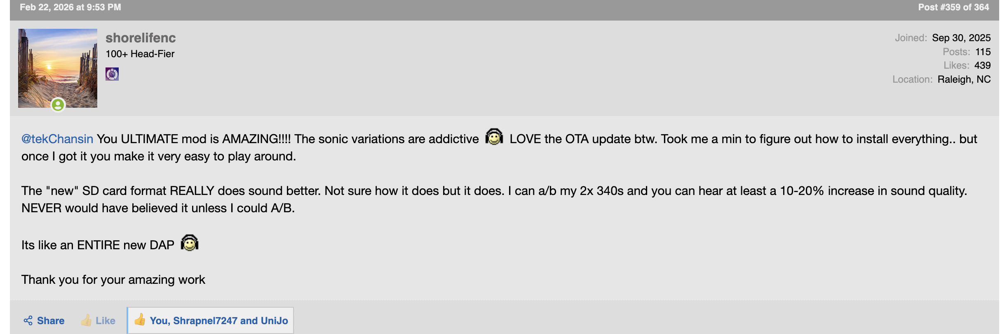
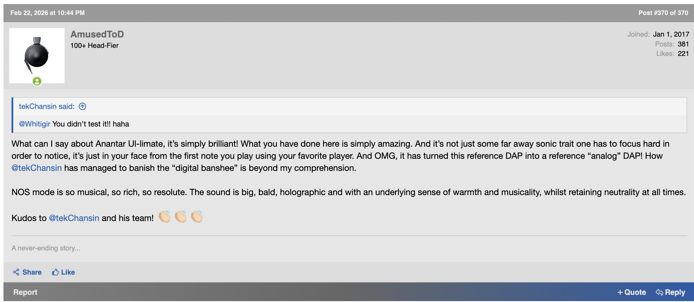

## 📝 Release Notes
## V4
https://www.head-fi.org/threads/dx340-guides-optimization-battery-replacements-diy-discussions.975654/post-19037433

#### V3.4-1 *Latest Release*
- Fixed NOS mode not run only first play

#### V3.4
- Fix Harmonic and NOS/OS mode loading not properly when device boot
- Improve FPGA power status checking before apply NOS mode
- Fix USB Battery bypass notification

#### **v3.3** 

ChangeLog

Fix minor bug, Auto profile don't select when user reinstall Anantar-Ultimate.

#### **v3.2**

ChangeLog

**✨ New Features & Enhancements:**

* **New "Velvet" Profile:** Introducing the new Harmonic Profile specifically tuned for the **AMP18** module, delivering a highly musical, lush, and engaging sound signature.
* **MangoOS DeepSleep:** Successfully integrated the automated **DeepSleep Mode** natively into MangoOS to maximize battery longevity during inactivity.
* **Auto "Sensors Off":** The system now automatically enables the "Sensors Off" feature by default to minimize background noise, reduce CPU interrupts, and lower system overhead.
* **Auto Profile:** Now Anantar will automatic select the best profile to match your Amp card.
* **OTA Notification:** System will check Anantar Ultiamte OTA Update and send notification to you.

**🐛 Bug Fixes:**
* **NOS Mode Seamless Playback:** Resolved the micro-pause/stutter issue that occurred in NOS (Non-OverSampling) mode when transitioning between different bit depths (16/24/32-bit) and DSD formats.

#### **v3.1**

ChangeLog

**🐛 Bug Fixes:**
* **Bluetooth Connectivity:** Fixed a critical bug where Bluetooth was not initializing or functioning properly.
* **Quick Settings Layout:** Resolved an issue that caused the Quick Settings Tile positions to reset to their default layout after every system reboot.

# Reviews

|  |  |