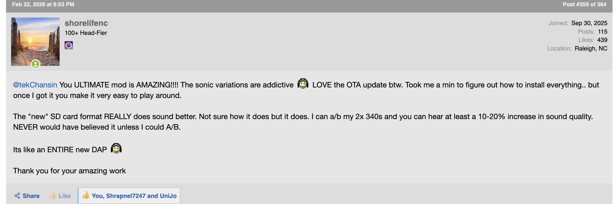
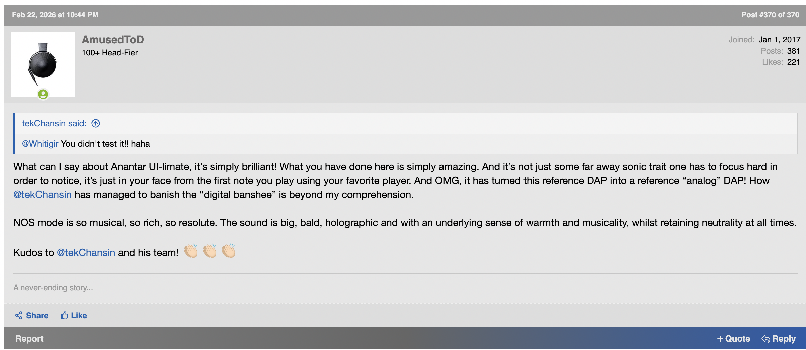

## 📝 Release Notes

---

## V6.0 — Anantar PowerScope & Salon Stage

#### 🔬 Anantar PowerScope — New Companion App
A brand-new app built exclusively for DX340 + Anantar Ultimate, exposing hardware data no stock app ever surfaces:
- **Dual-Battery Monitor** — real-time voltage, current, power, temperature, health, and charge cycles for both SoC and DAC batteries
- **Charger Deep Diagnostics** — direct I2C register reads from bq25892 / bq24192: VBUS, input current, DPM status, chip ID
- **24-Hour Battery History Charts** — capacity, voltage, power, temperature, and VSYS trends with swing analysis and peak markers
- **Live System Dashboard** — animated CPU gauge, RAM usage, Economy Mode polling
- **Anantar Config Viewer** — all active system properties in one view
- **OTA Update Tracker** — latest firmware version and changelog in-app

#### 🎭 Salon Infinity Stage
A new spatial stage added between Theatre and Chamber — refined, intimate, yet open.

#### ⚡ Faster App Loading
All apps launch faster system-wide via pre-compiled package optimization applied during installation.

#### 🐛 Bug Fixes
- Fixed YouTube crash

---

## V5.2
- Disable NOS as default profile
- Fix pop sound on NOS/OS mode
- Revert CPU Pinning

## V5.1
- Fix 1-second pause when using NOS/OS mode

---

## V5 — Infinity Stage

#### 🌌 Introducing Infinity Stage
A new heap memory configuration that unlocks a much larger, more immersive soundstage. Four distinct profiles:

| Profile | Description |
|---|---|
| 🎙️ **Studio** | Clinical precision and micro-detail with zero reverb. Honest and tight. |
| 🎻 **Chamber** | Wide, airy, naturally balanced stereo separation. Open and realistic. |
| 🎭 **Theatre** | Grand, cinematic immersion with rich ambient reverb. Best for orchestral/live. |
| 🎸 **Original** | The authentic V4 signature — balanced, familiar, and pure. |

#### 🧠 Improved CPU Pinning
- Reduced context switching — app runs steadily on specific cores
- Cleaner, more stable audio delivery with a noticeably blacker background
- More robust and technically refined listening experience

#### 🔋 Improved DeepSleep
- Reduce system wakelock (clock sync)
- Improved freeze of Google services during sleep

---

## V4
https://www.head-fi.org/threads/dx340-guides-optimization-battery-replacements-diy-discussions.975654/post-19037433

#### V3.4-1 *Latest Release*
- Fixed NOS mode not run only first play

#### V3.4
- Fix Harmonic and NOS/OS mode loading not properly when device boot
- Improve FPGA power status checking before apply NOS mode
- Fix USB Battery bypass notification

#### **v3.3** 

ChangeLog

Fix minor bug, Auto profile don't select when user reinstall Anantar-Ultimate.

#### **v3.2**

ChangeLog

**✨ New Features & Enhancements:**

* **New "Velvet" Profile:** Introducing the new Harmonic Profile specifically tuned for the **AMP18** module, delivering a highly musical, lush, and engaging sound signature.
* **MangoOS DeepSleep:** Successfully integrated the automated **DeepSleep Mode** natively into MangoOS to maximize battery longevity during inactivity.
* **Auto "Sensors Off":** The system now automatically enables the "Sensors Off" feature by default to minimize background noise, reduce CPU interrupts, and lower system overhead.
* **Auto Profile:** Now Anantar will automatic select the best profile to match your Amp card.
* **OTA Notification:** System will check Anantar Ultiamte OTA Update and send notification to you.

**🐛 Bug Fixes:**
* **NOS Mode Seamless Playback:** Resolved the micro-pause/stutter issue that occurred in NOS (Non-OverSampling) mode when transitioning between different bit depths (16/24/32-bit) and DSD formats.

#### **v3.1**

ChangeLog

**🐛 Bug Fixes:**
* **Bluetooth Connectivity:** Fixed a critical bug where Bluetooth was not initializing or functioning properly.
* **Quick Settings Layout:** Resolved an issue that caused the Quick Settings Tile positions to reset to their default layout after every system reboot.

# Reviews

|  |  |