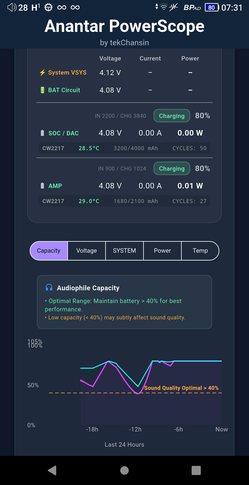
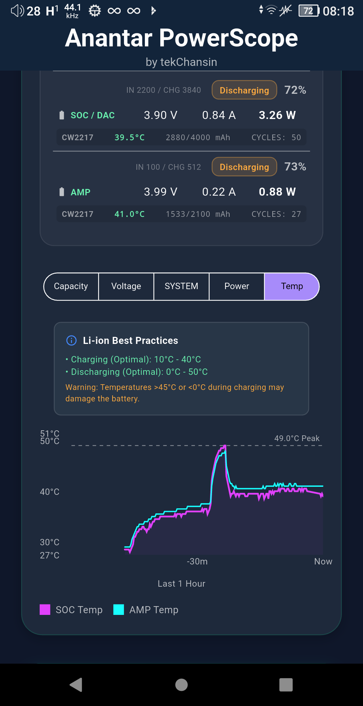
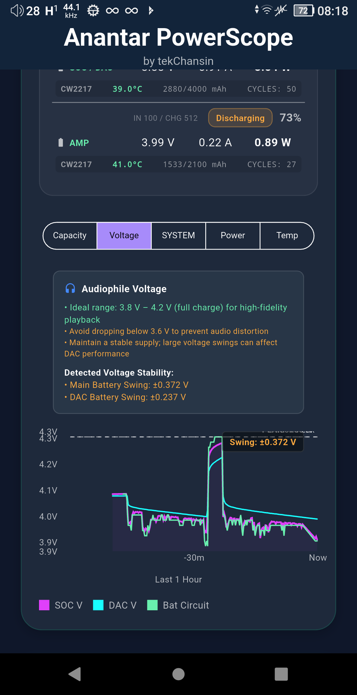

# Anantar PowerScope

**The ultimate battery monitoring and hardware diagnostic companion for iBasso DX340 audio players running the Anantar Ultimate custom firmware.**

Anantar PowerScope gives audiophiles and power users deep, real-time visibility into everything happening inside their DX340 — from dual-battery health and I2C charger registers to audio tuning parameters and over-the-air firmware updates. Built specifically for the Anantar Ultimate ecosystem, it surfaces data that no stock app ever exposes.

| | | |
| :---: | :---: | :---: |
|  |  |  |

---

## Table of Contents

- [Who Is This For?](#who-is-this-for)
- [Features](#features)
  - [Live System Dashboard](#live-system-dashboard)
  - [Dual-Battery Monitoring](#dual-battery-monitoring)
  - [Charger Deep Diagnostics](#charger-deep-diagnostics)
  - [Battery History & Charts](#battery-history--charts)
  - [Anantar Configuration Viewer](#anantar-configuration-viewer)
  - [OTA Update Tracker](#ota-update-tracker)
  - [Resources & Community](#resources--community)
- [Requirements](#requirements)
- [Installation](#installation)
- [Permissions](#permissions)
- [Technical Details](#technical-details)
- [Credits](#credits)

---

## Who Is This For?

Anantar PowerScope is designed for:

- **iBasso DX340 owners** running the **Anantar Ultimate** custom firmware
- Users who want to understand the health and behavior of their dual-battery system (SOC + DAC)
- Anyone interested in low-level hardware diagnostics — I2C registers, fuel gauge chips, charger ICs, and more

If you simply want to listen to music, this app is not for you. If you want to *understand* your device at the hardware level, this app is essential.

---

## Features

### Live System Dashboard

The home screen is an always-on hardware dashboard that refreshes in real time.

- **CPU Usage Gauge** — animated circular gauge showing current processor load at a glance
- **Memory Usage** — live display of used vs. total RAM in GB
- **Live Monitoring Toggle** — enable or disable continuous polling; an *Economy Mode* option reduces polling frequency to save battery when you only need occasional checks
- All data is pulled directly from Linux sysfs interfaces

---

### Dual-Battery Monitoring

The DX340 uses two separate battery systems: one powering the SoC (System-on-Chip) and one dedicated to the DAC circuitry. Anantar PowerScope monitors both simultaneously.

For **each battery** you get:

| Metric | Description |
|---|---|
| State of Charge | Percentage remaining |
| Voltage | Real-time cell voltage (mV) |
| Current | Charge/discharge current (mA) |
| Power | Instantaneous power draw (mW) |
| Temperature | Cell temperature with color-coded safety indicators |
| Health | Battery health status reported by the kernel |
| Charge State | `Charging`, `Discharging`, `Full`, `Bypass` |
| Capacity (mAh) | Design and full charge capacity |
| Charge Cycles | Number of complete charge cycles logged |
| Min / Max Temperature | Lifetime temperature range recorded by the fuel gauge chip |

**Temperature color coding:**
- Green — normal operating range
- Orange — elevated, monitor closely
- Red — high temperature warning

**Battery Bypass Mode** — when the DX340 is in bypass mode (running directly from the charger without cycling the battery), the app detects and displays this state clearly.

---

### Charger Deep Diagnostics

Anantar PowerScope reads directly from the I2C charger ICs (bq25892 for SOC, bq24192 for DAC) to surface data that no stock app exposes.

**VBUS / Input metrics:**
- VBUS input voltage (mV)
- Input current limit and actual input current (mA)
- Charger detection type: SDP, CDP, DCP, OTG, and more

**System & Battery Circuit:**
- VSYS (system bus) voltage
- Battery circuit voltage at the charger terminals
- Fast charge current limit

**Dynamic Power Management (DPM):**
- DPM status — whether the charger is throttling input current to protect the power source
- Input current optimization state

**Chip Information:**
- Chip ID and firmware revision
- CW2215 / CW2217 / CW2218 fuel gauge decoded data
- Register-level hex values available for advanced debugging

All register reads are performed via `i2cget` with full ADC conversion and bit-field parsing handled in-app.

---

### Battery History & Charts

Anantar PowerScope automatically records a snapshot of both batteries every 15 minutes in the background, building a rolling 24-hour history log — even when the app is closed.

**Interactive line charts** let you visualize trends over time:

| Chart Metric | What It Shows |
|---|---|
| Capacity (%) | SOC and DAC state-of-charge over 24 hours |
| Voltage (mV) | Cell voltages for both batteries |
| Power (mW) | Instantaneous power for SOC, DAC, and USB input |
| Temperature (°C) | Cell temperatures — detect thermal patterns |
| VSYS Voltage | System bus voltage stability over time |

**Swing Analysis** — the chart automatically detects and annotates the maximum voltage swing (peak-to-valley difference) within the visible time window, helping you spot unusual charge/discharge behavior.

**Peak indicators** are marked directly on the chart line so you can immediately see the highest and lowest points in each session.

History is stored locally using SharedPreferences and automatically pruned to the last 24 hours — no cloud sync, no privacy concerns.

---

### Anantar Configuration Viewer

See every active Anantar and iBasso system property in one place, organized in a clean two-column dashboard layout.

### OTA Update Tracker

Stay informed about the latest Anantar Ultimate firmware releases without leaving the app.

- Fetches the current OTA manifest from the Anantar update server
- Displays the **latest firmware version number**
- Shows a **changelog summary** so you know what changed before you update
- Tapping the changelog opens the full release notes in the built-in WebView
- Update information is cached locally so it's available offline

---

### Resources & Community

A dynamic resources section, powered by Supabase, provides curated links to documentation, guides, community forums, and support channels — all maintained server-side so the content stays fresh without requiring an app update.

Each resource tile shows:
- Title and subtitle
- Color-coded category icon
- Opens in the built-in in-app WebView for a seamless reading experience

**Offline support** — all previously loaded web content is cached locally so you can revisit documentation even without an internet connection.

---
## ☕ Support My Work

The **Anantar Ultimate** edition is a free created specifically for those who wish to support my ongoing research and development. This version includes **features, deeper kernel tuning, and a unified interface**. Your support helps me spend more time fine-tuning the DX340 to its absolute limit. **This is 100% Optional.**

| Platform | Donation Link / Address |
| :--- | :--- |
| **PayPal** | tekChansin:  Whitigir: |
| **Bitcoin** | `0x794161ef033bd117a45f4dbeda023b5a69cc7cd5` |
---

## Credits

Developed by **tekChansin** as part of the Anantar Ultimate ecosystem.

Special thanks to the iBasso DX340 community for hardware documentation, testing, and feedback.

---

*Anantar PowerScope is an unofficial third-party application. It is not affiliated with or endorsed by iBasso Audio.*
